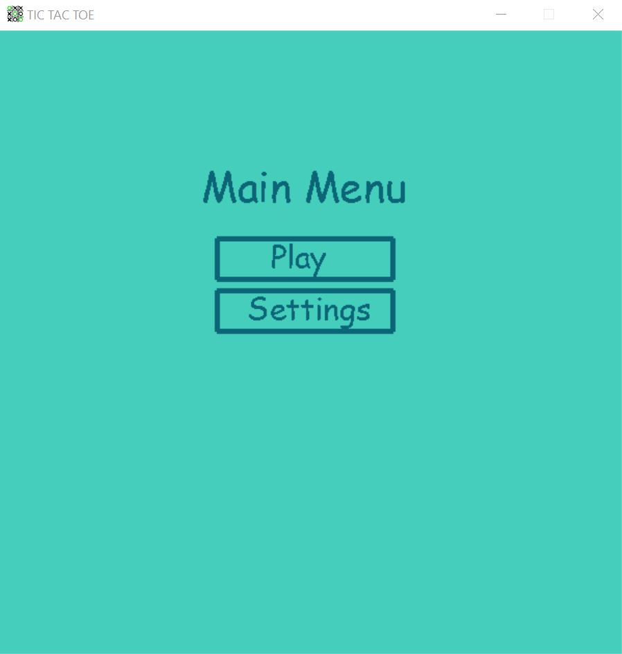
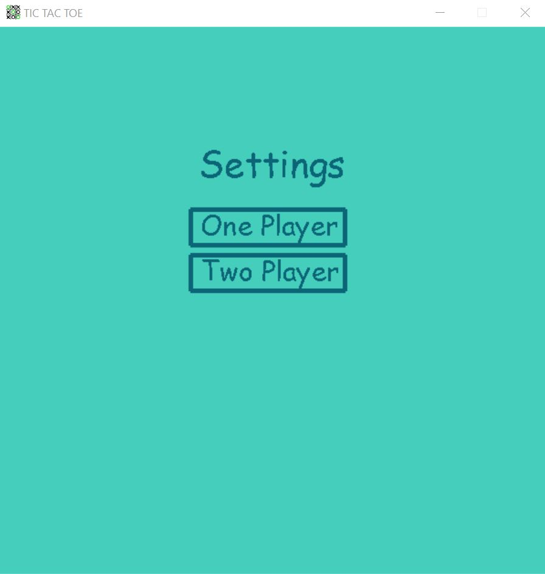
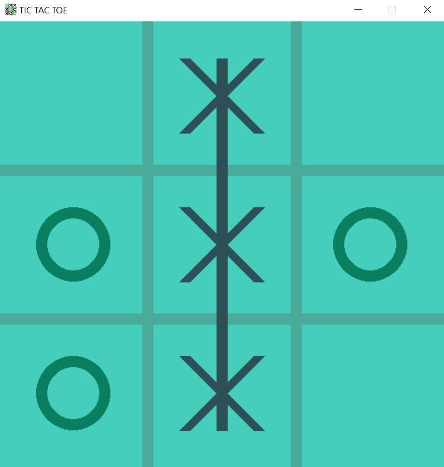

# Tic-Tac-Toe
### This a simple tic-tac-toe game which includes a graphica GUI. Run main.py to tic-tac-toe  

### This game have to following features:
- One player mode against bot 
- Two player mode agaisnt another user

### Some key shortcuts:
- 'escape' key allow user to go back to main menu
- 'r' key allow user to restart the game 

 
 
 

